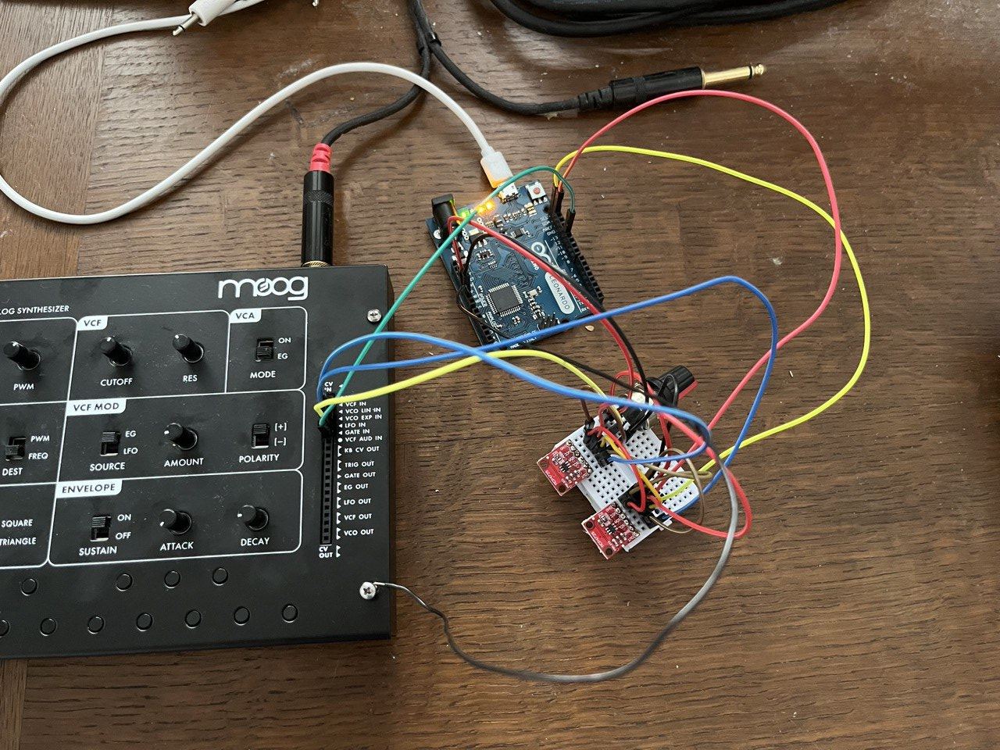
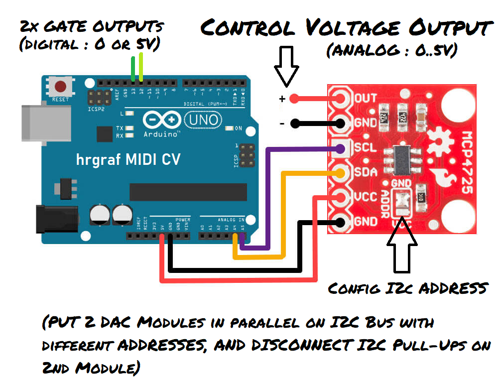

# Arduino MIDI to Gate/Control Voltage bridge.

Works out-of-the-box on Arduino Uno / Leonardo compatible boards.
No MIDI DIN circuit needed, as MIDI events are sent/received over USB.

Functionality:
- Received Note On/Off messages control built-in LED and GATE_OUT pin, 
and create a pitch control voltage (0..5V) using DAC MCP4725 over I2C.
(For common 1V/octave configurations, this covers 5 octaves.)
- Received Pitch Bend messages alter the pitch control voltage additionally
(by +- 1V corresponding commonly to +- 1 octave)
- Received Modulation Wheel (Control Change) messages create a mod control 
voltage (0..5V) using a 2nd DAC MCP4725 over I2C.

On the Arduino Uno, the serial interface is used to send MIDI over USB
at 115200 baud. On the host (PC), the USB communication is accessible 
as virtual COM port. There, some additional SW is required to translate 
between UART and MIDI. The baud rate of 115200 is compatible to both
  - Hairless MIDI to Serial Bridge
  - [my pizmidi/midiUartBridge (recommended!)](https://github.com/hrgraf/pizmidi)

On the Arduino Leonardo, the USB MIDI functionality is built-in and the 
serial interface is available for serial monitor / debug messages.
No additional drivers needed on the host (PC) side.

Here is a picture of the Arduino Leonardo with 2 MCP4725 DAC modules controlling 
a Moog Werkstatt analog synthesizer by control voltages and gate signal:

This is effectively adding a USB-MIDI interface to the analog synthesizer!

Here is a wiring diagram of the setup:

