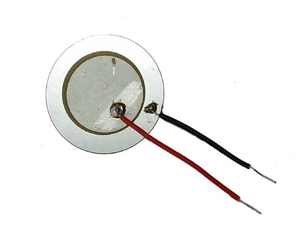
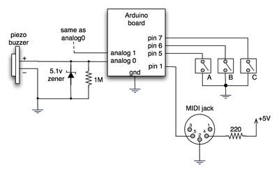
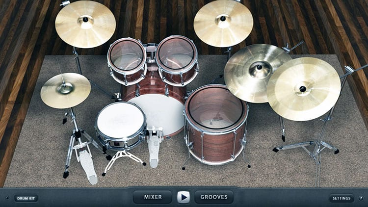

# Arduino MIDI Drum Kit

Piezo to MIDI

The wiring is simple: every Piezo gets in parallel a resistor of 1M and 
a diode (e.g. 1N4007) towards positive (red) pin.
The negative (black) pins are connected to Arduino Ground (GND), 
while the individual positive (red) pins get connected to the Arduino Analog Inputs (A0 .. A7).

MIDI out is either direct at 31250 baud over the serial interface, 
or over USB as virtual COM port at 115200 baud.

On the host (PC), the MIDI communication over USB is accessible 
as virtual COM port. There, some additional SW is required to translate 
between UART and MIDI. The baud rate of 115200 is compatible to both
  - Hairless MIDI to Serial Bridge
  - [my pizmidi/midiUartBridge (recommended!)](https://github.com/hrgraf/pizmidi)

For a good VST Drum Kit, I recommend the free MT Power Drum Kit:

